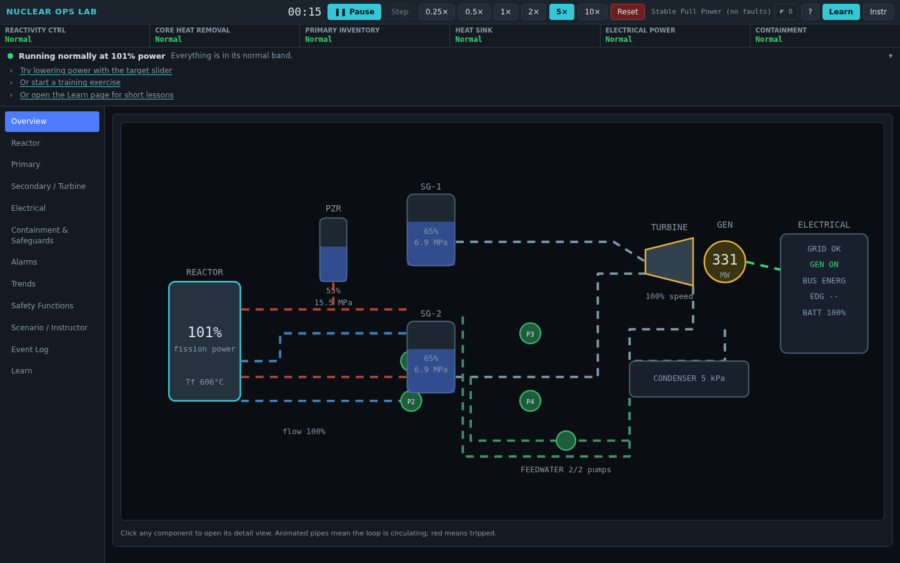
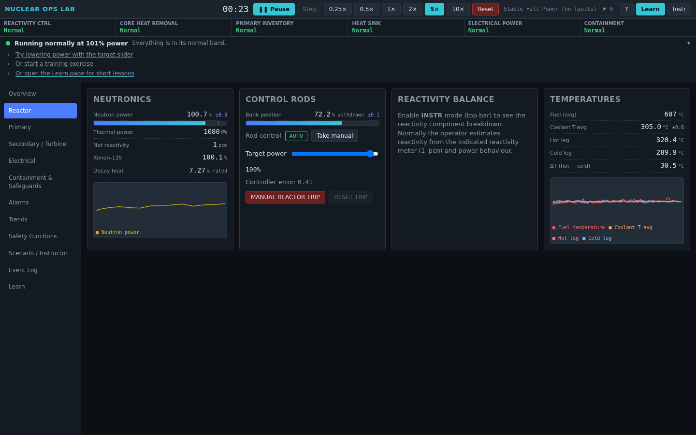
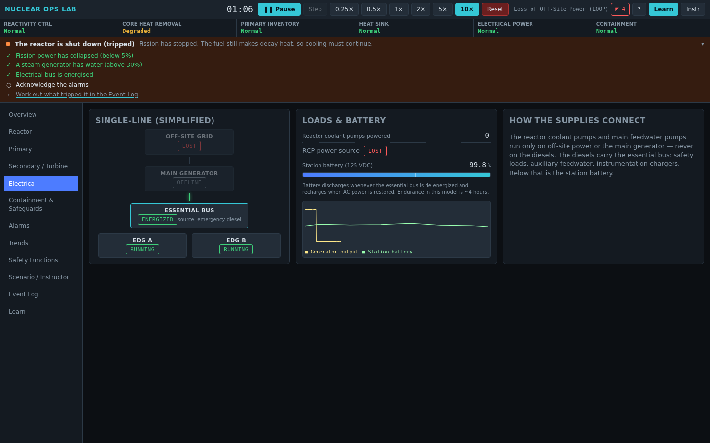
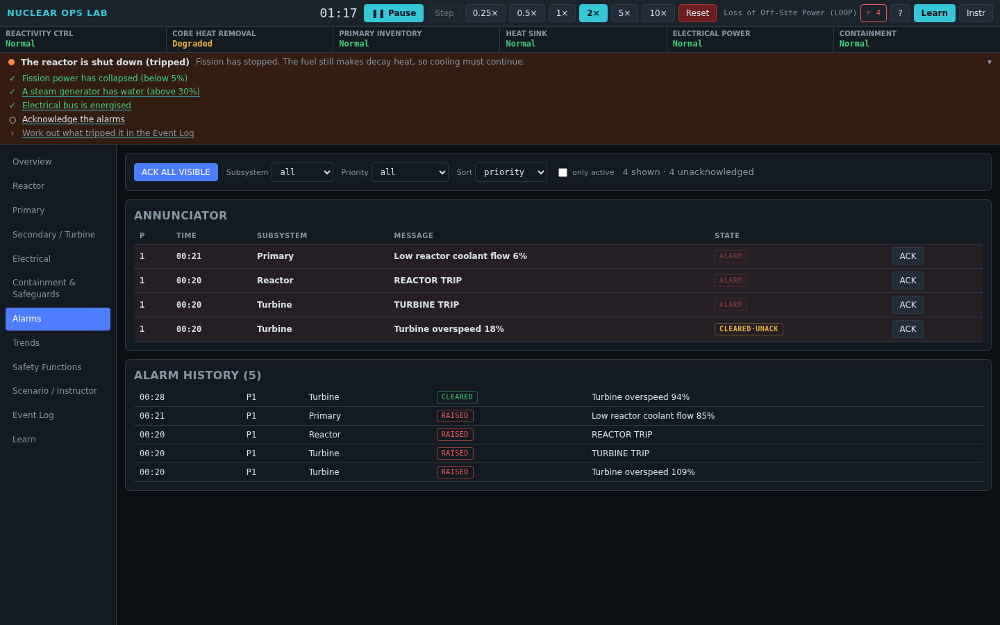
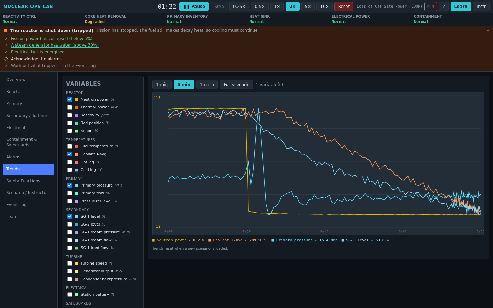
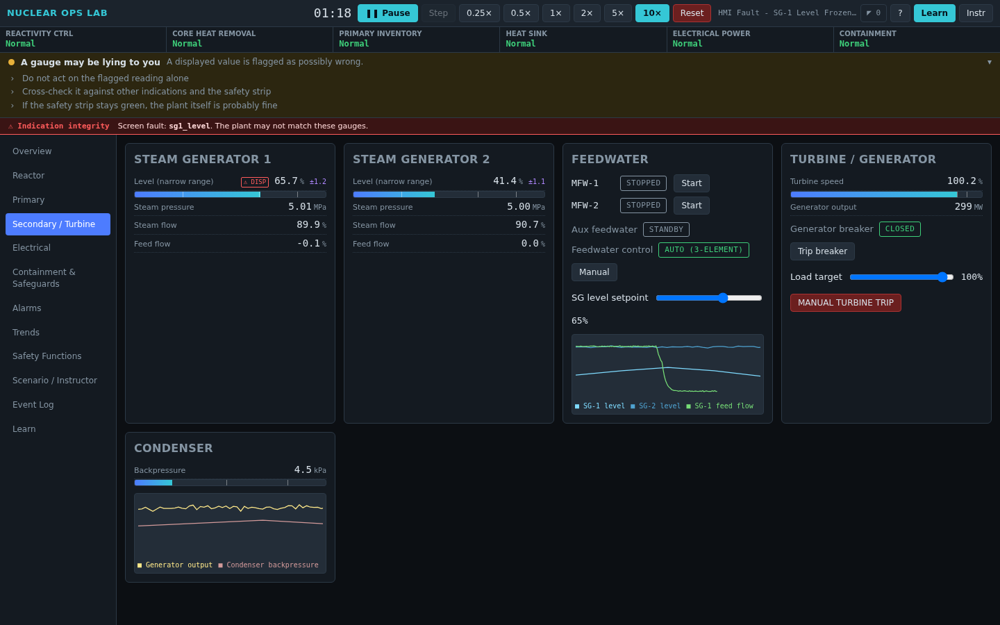
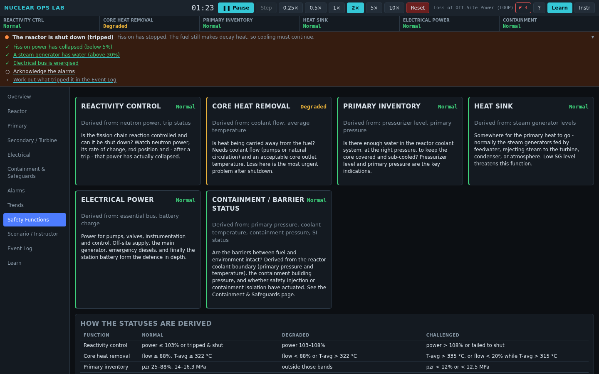
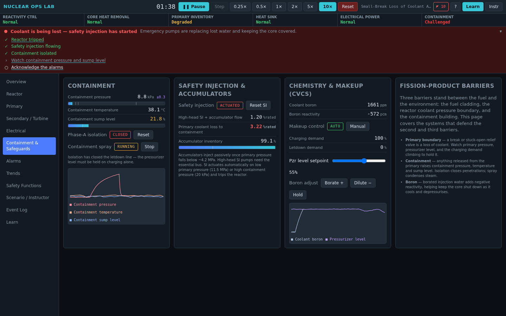
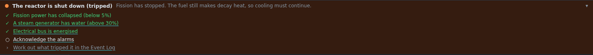

# Open Nuclear Ops Lab

A browser-based, **local-only** educational simulator that looks and feels like
a simplified control-room / operator-training station for a **fictional
PWR-like nuclear power plant**.

**▶ Live app: https://jFriedli.github.io/open-nuclear-ops-lab/**

> ### ⚠️ Educational software only
> This is a simplified, fictional teaching toy. It is **not** for real reactor
> operation, engineering or safety analysis, licensing calculations, operator
> certification or training credit, and it does **not** model any real plant.
> Every setpoint, coefficient and configuration is invented for teaching.
> See [`docs/MODEL_LIMITATIONS.md`](docs/MODEL_LIMITATIONS.md).



## What it is

A hands-on way to build intuition about how the pieces of a pressurised-water
plant fit together - reactor, primary loop, steam generators, turbine,
condenser, feedwater, and electrical supply - and, above all, to practise
**distinguishing a process failure from an instrument failure from a
control-system failure from an operator error.**

| | |
|---|---|
|  |  |
|  |  |
|  |  |
|  |  |

### Highlights

- **Deterministic physics engine** in Rust → WebAssembly, running in a Web
  Worker at 50 Hz. Six-group point kinetics, temperature feedback, decay heat,
  xenon, a two-loop primary with pressuriser, two steam generators, turbine /
  generator, a simplified electrical system, and a lumped CVCS / boron / safety
  injection / single-volume containment model for loss-of-coolant events.
- **Layered by design:** physical process → instrumentation → signal
  processing → control / protection → HMI. Faults inject at any level: a raw
  sensor channel (A/B/C, caught by voting/disagreement), a signal-processing
  fault (fools control *and* display - redundancy can't catch it), or an
  **HMI-only fault** (the gauge lies but the plant and its automation don't).
  A red *indication-integrity* banner and `hmi_truth` in debug mode make the
  discrepancy visible.
- **Deterministic session record & replay:** every operator command is taped
  with its simulation tick; export a self-contained session and replay it to
  reproduce the run exactly.
- **Real alarm model** - latched, prioritised, acknowledgeable, filterable,
  with history. Not toast notifications.
- **Event / scenario engine** as a first-class subsystem: declarative JSON,
  13 single-fault + 3 combined scenarios, plus an instructor fault-injection
  panel. Import your own (validated as untrusted input).
- **Critical Safety Functions** overview derived from multiple signals.
- **Learn mode vs Challenge mode.** Learn mode adds a contextual coach that
  reads the live plant and tells a newcomer what to do next — start-up,
  power manoeuvres, post-trip recovery, loss of coolant. Challenge mode turns
  all coaching off. Two guided tours (a two-minute first look and a full
  control-room walkthrough that explains every display and control) and
  objective-tracked lessons sit on the Learn page.
- **Trends** with selectable variables and 1 / 5 / 15 min / full-scenario
  windows; **event log** with simulation timestamps.
- Pause / single-step / 0.25×–10× clock. Identical scenario + seed + actions
  ⇒ identical outcome.
- No backend, no auth, no database, no network calls. Preferences in
  localStorage, custom scenarios in IndexedDB.

## The acceptance run

From the deployed site: load the app → the plant starts at a stable ~100%
power → start the **Loss of Off-Site Power** scenario → off-site power is lost,
the RCPs trip, low flow trips the reactor, the turbine trips, the essential
bus transfers to the emergency diesels, decay heat continues, the operator
acknowledges the alarm burst, the event log records everything, and pausing
freezes the picture for inspection. Re-running the same scenario is
deterministic.

## Run it locally

```bash
# engine
cd engine && cargo test

# app
cd ../app
npm ci
npm run build:wasm      # Rust -> WASM (needs rustup + wasm-pack)
npm start               # http://localhost:4200
```

More in [`docs/DEVELOPMENT.md`](docs/DEVELOPMENT.md).

## Documentation

| Doc | |
|---|---|
| [ARCHITECTURE.md](ARCHITECTURE.md) | system design, the four layers, the clock |
| [docs/PHYSICS.md](docs/PHYSICS.md) | every equation and constant, with the numbers used |
| [docs/MODEL_LIMITATIONS.md](docs/MODEL_LIMITATIONS.md) | what the model does *not* do - read this |
| [docs/SCENARIOS.md](docs/SCENARIOS.md) | scenario JSON format, target/action vocabulary, the shipped set |
| [docs/INSTRUMENTATION.md](docs/INSTRUMENTATION.md) | the layered architecture and the future fault-injection points |
| [docs/DEVELOPMENT.md](docs/DEVELOPMENT.md) | prerequisites, layout, common tasks |
| [CONTRIBUTING.md](CONTRIBUTING.md) | ground rules (educational only, no proprietary material) |

## Tech

Rust + `wasm-bindgen` · Angular (standalone, zoneless, signals) · Web Worker ·
Canvas trends · Vitest · Playwright · GitHub Actions → GitHub Pages.

## References

Concepts and validation intuition were informed by publicly available
reactor-physics teaching material, including the point-kinetics and
decay-heat treatments common to open educational projects such as the Open
Nuclear Engineering teaching resources. No code was copied; the engine is a
clean, independent implementation. All explanatory text was written for this
project from general public-domain engineering knowledge.

## License

[MIT](LICENSE), with an additional notice reinforcing that this is
educational-only software.
